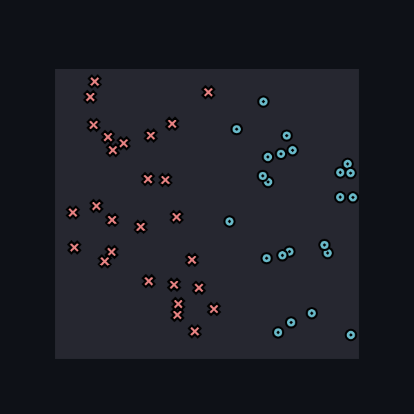
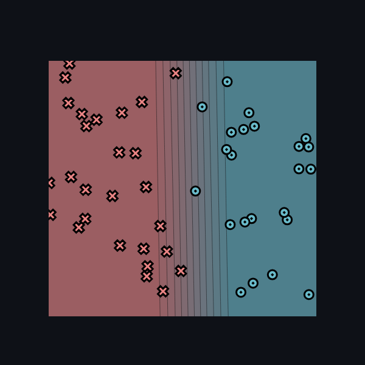
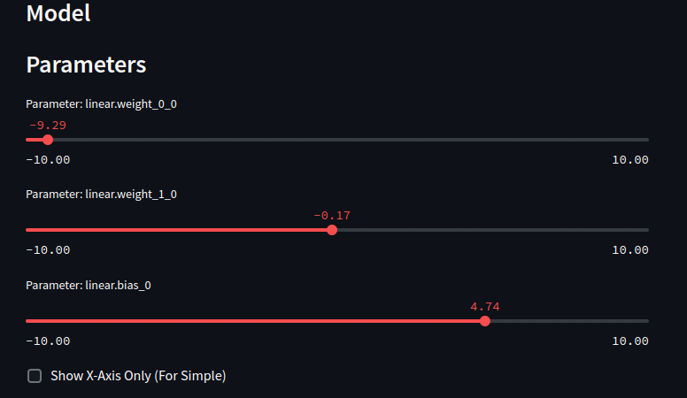

# MiniTorch Module 0

* Docs: https://minitorch.github.io/

* Overview: https://minitorch.github.io/module0/module0/

* The dataset for classifiation

* The result obtained

* The parameter values used were:
